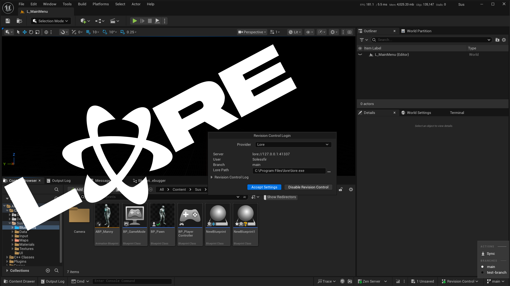

# Lore Source Control

Unreal Engine plugin implementing `ISourceControlProvider` for [lore](https://github.com/EpicGames/lore)

## Supported Platforms

- Windows
- Linux
- macOS

## Features

- **Sync** - pull latest (`lore sync`), one click from the toolbar dropdown
- **Commit** - stages, commits, and auto-pushes to remote in one step
- **Lock / Unlock** - advisory file locking (`lore lock acquire` / `lore lock release`)
- **Branch Switching** - toolbar dropdown next to the Revision Control icon, with auto-reload
- **File History** - revision browsing, diffing, and "Diff Against Depot"
- **Status Tracking** - live Content Browser and asset-dialog icons
- **Revert / Add** - standard source control workflow, fully wired up

## Requirements

- Lore CLI (`lore`) available, either on your `PATH` or at an explicit path set in Project Settings.
- A Lore repository checked out (contains a `.lore` folder at the root), with `remote_url` and
  `identity` configured in `.lore/config.toml` if you want push/pull and commits to work.

## Installation

Clone into your project's `Plugins/` folder and build.

Prebuilt binary available on [Fab](https://fab.com/s/34bd22b20f98) if you'd like to support the project.

## Getting Started

1. **Revision Control** (bottom right of the main editor window) → **Connect to Revision Control...**
2. In the popup: **Provider** → select **Lore**.
3. If Lore is installed correctly, the binary path auto-detects.
4. **Accept Settings**. All set - a branch/actions dropdown appears next to the Revision Control icon.

## Configuration

**Project Settings → Plugins → Lore Source Control**:
- **Lore Path** - override the `lore` binary location. Leave empty to auto-detect (PATH, then
  common install locations).
- **Lock Files On Check Out** - toggle whether Check Out acquires/releases a Lore lock.

## Console Commands

- **`LoreSync`** - performs a Lore sync (pull) and updates source control states.
- **`LoreStatus`** - force-refreshes Lore source control status for the project and prints
  lore's human-readable status to the log.
- **`LoreCommit`** - opens the Submit Files dialog to stage, commit, and push pending changes.

## Notes

- **Locking is advisory, not enforced.** A lock is a courtesy signal to teammates, not a hard
  guarantee - Lore's server never rejects a commit or push from someone who skipped locking
  entirely, and files stay editable regardless of lock state (matches Git's model, not Perforce's).

## License

MIT, see [LICENSE](LICENSE). This plugin talks to a separately-installed `lore` binary rather than
bundling it - Lore itself is [MIT-licensed](https://github.com/EpicGames/lore) too, but under its
own terms.
