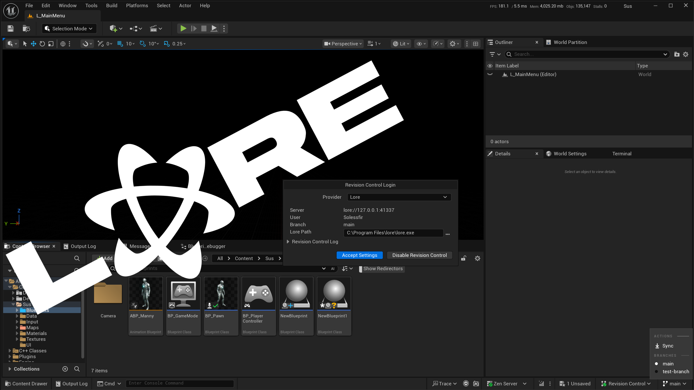

# Lore Source Control

Unreal Engine plugin implementing `ISourceControlProvider` for [lore](https://github.com/EpicGames/lore)



## Supported Platforms

- Windows
- Linux
- macOS

## Features

- **Sync** - pull latest (`lore sync`) from the toolbar dropdown, with progress and completion feedback
- **Commit** - stages and commits in one step, then auto-pushes when a remote is configured
- **Lock / Unlock** - advisory file locking (`lore lock acquire` / `lore lock release`)
- **Branch Switching** - toolbar dropdown next to the Revision Control icon, with unsaved-work protection, progress feedback, and asset reload or restart handling
- **File History** - revision browsing, diffing, and "Diff Against Depot"
- **Status Tracking** - live Content Browser and asset-dialog icons
- **Revert / Add / Delete** - restore staged changes, add files, and remove files from disk while staging tracked deletions

On Linux, commands run in the repository directory and preserve quoted,
multiline commit descriptions and literal filenames, including leading
hyphens. Paths are case-sensitive on Linux, including scoped refreshes and partial commits.
Lock ownership uses the server's current user rather than the
configured commit author, including Epic Lore's anonymous server mode.
Selected-file submits reject unrelated staged changes. Unstage those changes before submitting only the selected files. If a submit succeeds but releasing its locks fails, the Source Control message log reports the failure so the locks can be released with Unlock.

## Requirements

- Lore CLI available, either on your `PATH` or at an explicit path set in Project Settings.
- A Lore repository with a `.lore` directory in the Unreal project directory or one of its parents. Configure an identity for commits and a remote URL for sync, push, and locks.

## Installation

Clone into your project's `Plugins/` folder and build.

Prebuilt binary available on [Fab](https://fab.com/s/34bd22b20f98) if you'd like to support the project.

## Create or Clone a Lore Repository

Clone a remote repository and store the commit identity in `.lore/config.toml`:

```bash
lore clone --identity your-name lore://server.example.com:41337/my-project MyProject
```

To initialize the current directory as a fully local repository without a server, run:

```bash
lore repository create --offline --identity your-name my-project
```

Lore does not use a separate `init` command. The offline form above creates the `.lore` directory in the current directory and leaves `remote_url` empty. The standard Submit action commits locally and skips pushing when no remote is configured. Lore locks are also skipped automatically because they require a server.

## Getting Started

1. **Revision Control** (bottom right of the main editor window) → **Connect to Revision Control...**
2. In the popup: **Provider** → select **Lore**.
3. If Lore is installed correctly, the binary path auto-detects.
4. **Accept Settings**. All set - a branch/actions dropdown appears next to the Revision Control icon.

## Configuration

**Project Settings → Plugins → Lore Source Control**:

- **Lore Path** - override the `lore` binary location. Leave empty to auto-detect from `PATH`, then common install locations.
- **Use Lore Locks On Check Out** - acquire advisory Lore locks during Check Out. Files remain editable, and locks are released after submit or revert.

## Console Commands

- **`LoreSync`** - performs a Lore sync (pull) and updates source control states.
- **`LoreStatus`** - force-refreshes Lore source control status for the project and prints Lore's human-readable status to the log.
- **`LoreCommit`** - opens the Submit Files dialog to stage and commit pending changes, then pushes when a remote is configured.

## Automated Tests

Parser, worker, provider lifecycle, and native Lore CLI tests live in the separate `LoreSourceControlTests` editor module. The integration tests use the configured Lore binary and remove their isolated repositories after each run. Run the `LoreSourceControl` test group from Unreal's Session Frontend Automation tab or from the command line:

```text
UnrealEditor-Cmd.exe YourProject.uproject -unattended -nullrhi -ExecCmds="Automation RunTests LoreSourceControl" -TestExit="Automation Test Queue Empty"
```

On Linux, use the matching engine's `Engine/Binaries/Linux/UnrealEditor-Cmd`
with the same arguments. The Lore binary can be configured in Project Settings
or found on `PATH`. Native integration tests cover temporary repositories,
literal file arguments, commit descriptions, revision downloads, and selected-file delete/revert through Unreal's real process launcher.

Set `LORE_TEST_REMOTE` to a fresh repository URL on a disposable Lore server
to enable the native remote submit test. It checks checkout ownership,
selected-file submission, unrelated staged work, push, and lock release.
Local repositories are removed after each test; dispose of the test server's
storage afterward to remove its remote fixtures.

## Notes

- **Locking is advisory, not enforced.** A lock is a courtesy signal to teammates, not a hard guarantee. Lore's server never rejects a commit or push from someone who skipped locking entirely, and files stay editable regardless of lock state, matching Git's model rather than Perforce's.

## License

MIT, see [LICENSE](LICENSE). This plugin talks to a separately installed `lore` binary rather than bundling it. Lore itself is [MIT-licensed](https://github.com/EpicGames/lore) too, under its own terms.
